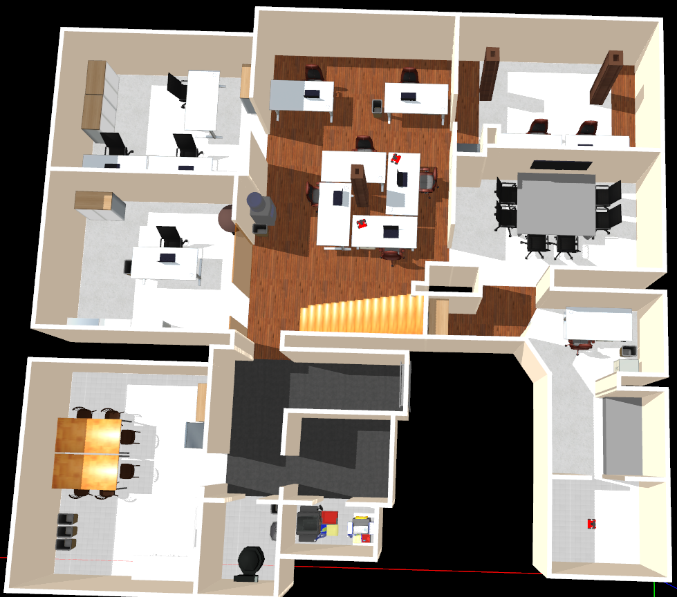
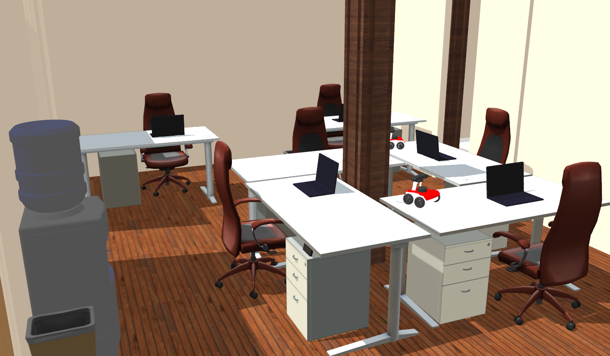
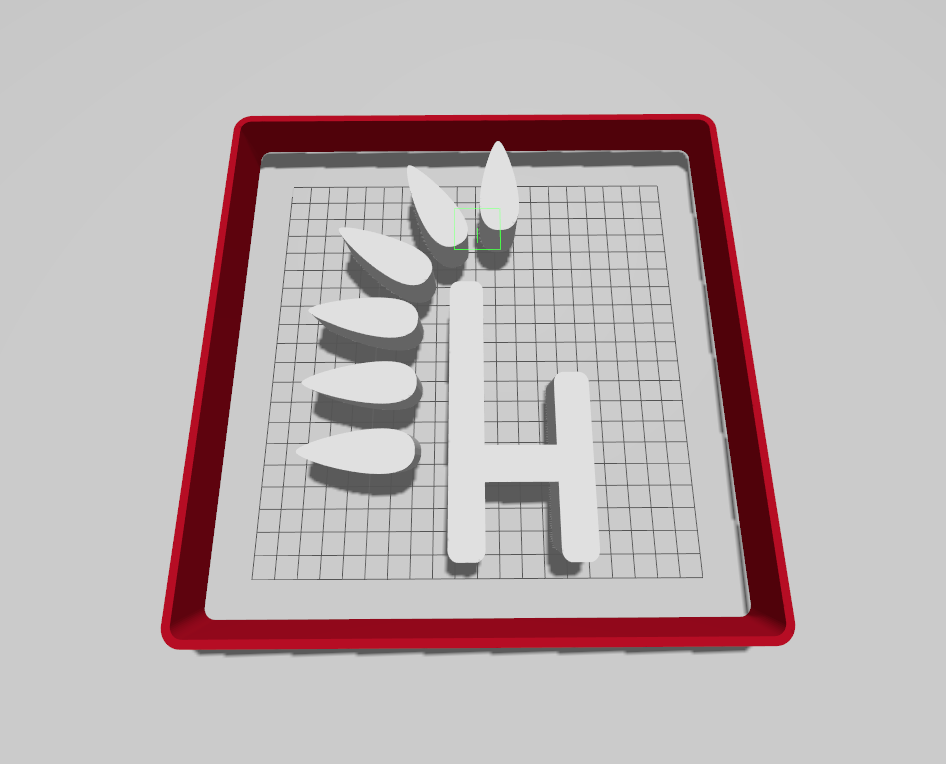

# Husarion Gazebo Worlds

A repository containing sample worlds to run in the gazebo simulation.

**Available worlds:**

- `empty_with_plugins.sdf` - Empty world with attached plugins necessary for the proper operation of our robots,
- `husarion_office.sdf` - World resembling the office we work in,
- `husarion_world.sdf` - World representing our logo.

## Quick start

### Create workspace

```bash
mkdir -p ~/ros2_ws
cd ~/ros2_ws
git clone https://github.com/husarion/husarion_gz_worlds.git src/husarion_gz_worlds
```

### Build

```bash
colcon build
```

### Running

```bash
source install/setup.bash
ros2 launch husarion_gz_worlds gz_sim.launch.py
```

**Launch arguments:**

| ARGUMENTS            |                                                                                                              | DEFAULT VALUE                                              |
| -------------------- | ------------------------------------------------------------------------------------------------------------ | ---------------------------------------------------------- |
| **gz_gui**           | Run simulation with specific GUI layout                                                                      | **`husarion_gz_worlds/`<br />`config/teleop.config`**     |
| **gz_headless_mode** | Run the simulation in headless mode. Useful when a GUI is not needed or to reduce the amount of calculations | **False**                                                  |
| **gz_log_level**     | Adjust the level of console output                                                                           | **1**                                                      |
| **gz_world**         | Absolute path to SDF world file                                                                              | **`husarion_gz_worlds/`<br />`worlds/husarion_world.sdf`** |

### Results

#### husarion_office.sdf




#### husarion_world.sdf


